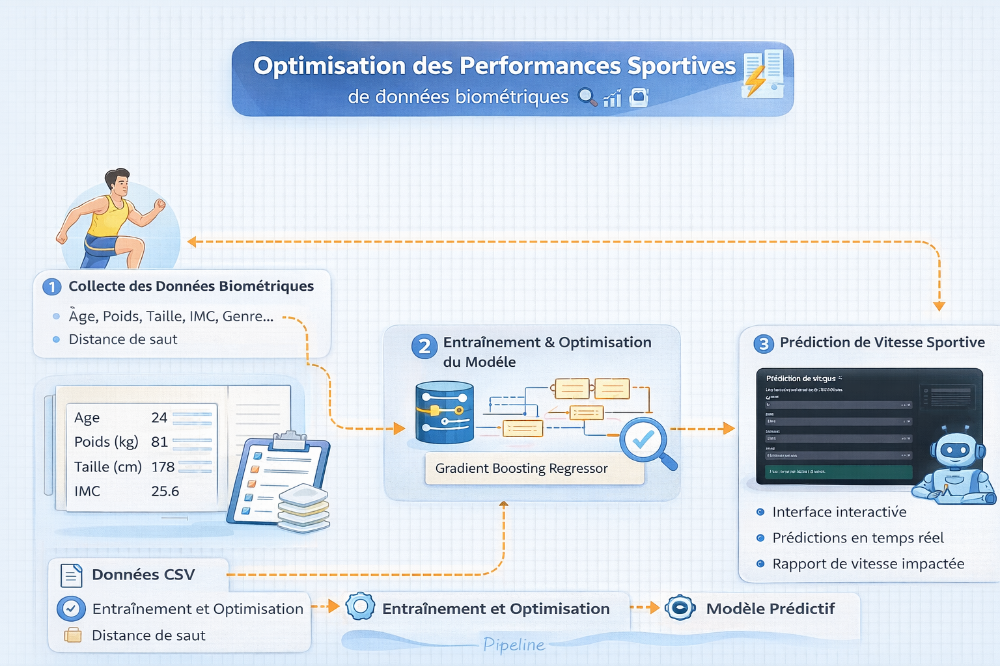
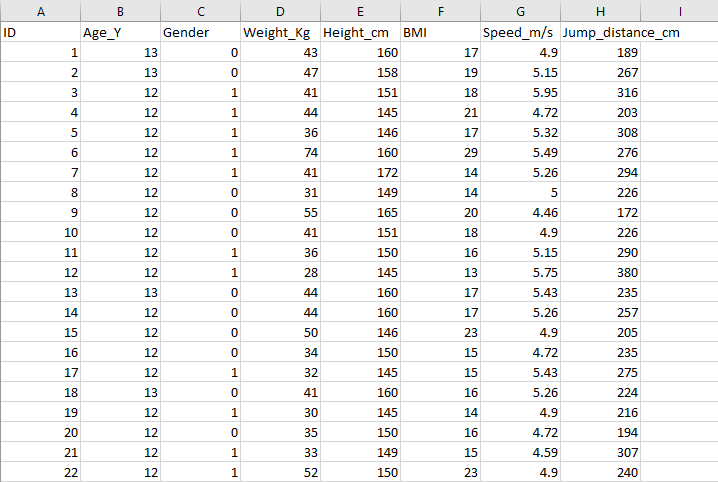
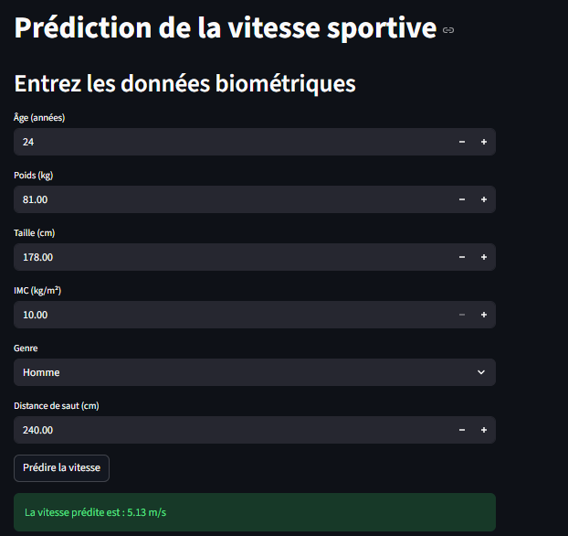

# ⚽ Optimisation des performances sportives à partir de données biométriques

## 📌 Description

Ce projet vise à prédire la **vitesse sportive (m/s)** à partir de **données biométriques** simples en utilisant le machine learning.

Il combine :
- 📊 analyse de données
- 🤖 modèle de régression (Gradient Boosting)
- 💻 interface interactive (Streamlit)

👉 Objectif : fournir un outil simple d’aide à l’évaluation des performances sportives.

---

## 🧠 Pipeline du projet



---

## 📊 Aperçu du dataset

Le dataset contient des variables biométriques et de performance.



### Variables utilisées :
- Age_Y
- Weight_Kg
- Height_cm
- BMI
- Gender
- Jump_distance_cm

🎯 Target :
- Speed_m/s

---

## 🖥️ Interface de l'application

Application développée avec Streamlit pour une utilisation simple :



---

## 🎯 Objectifs

- Prédire la vitesse sportive
- Optimiser un modèle de régression
- Créer une interface interactive
- Illustrer une application de la data science dans le sport

---

## 🧠 Méthodologie

### 1. Préparation des données
- Chargement dataset
- Sélection des variables

### 2. Modélisation
- GradientBoostingRegressor
- GridSearchCV (optimisation)

### 3. Évaluation
- MSE
- R² Score

### 4. Déploiement
- Interface Streamlit

---

## 📁 Structure du projet

```
├── app.py
├── model.py
├── dataset.csv
├── cleaned_dataset.csv
├── model.pkl
├── dataset.png
├── interface.png
├── sport_pipeline.png
└── README.md
```

---

## ⚙️ Technologies utilisées

- Python
- Pandas
- Scikit-learn
- Streamlit
- Pickle

---

## 🤖 Modèle utilisé

**Gradient Boosting Regressor**

Optimisé avec :
- n_estimators
- max_depth
- learning_rate

---

## 🚀 Installation

```bash
git clone https://github.com/MTheAnalyst/1-performance-sportive-prediction.git
cd 1-performance-sportive-prediction
```

```bash
pip install pandas scikit-learn streamlit
```

---

## ▶️ Exécution

### Entraînement
```bash
python model.py
```

### Lancer l'application
```bash
streamlit run app.py
```

---

## 📊 Résultats

- ✔️ Modèle performant (R² élevé)
- ✔️ Prédictions en temps réel
- ✔️ Interface simple et intuitive

---

## ⚠️ Limites

- Dataset limité
- Variables simplifiées
- Pas de données temps réel

---

## 🔮 Perspectives

- Ajouter plus de variables physiologiques
- Tester d'autres modèles (XGBoost, Random Forest)
- Déployer en ligne
- Ajouter visualisations

---

## 👨‍🎓 Auteur

**Elmahdi MAHROUK**  
Master Science des Données et Analytique

---

## 📜 Licence

Projet académique
